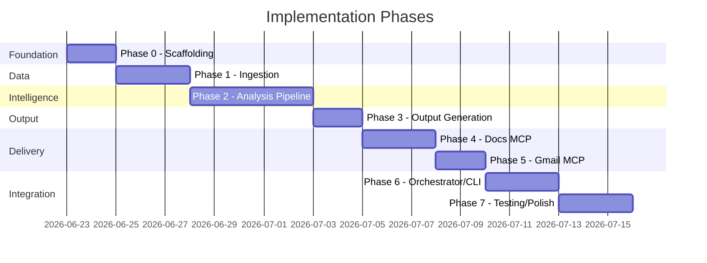
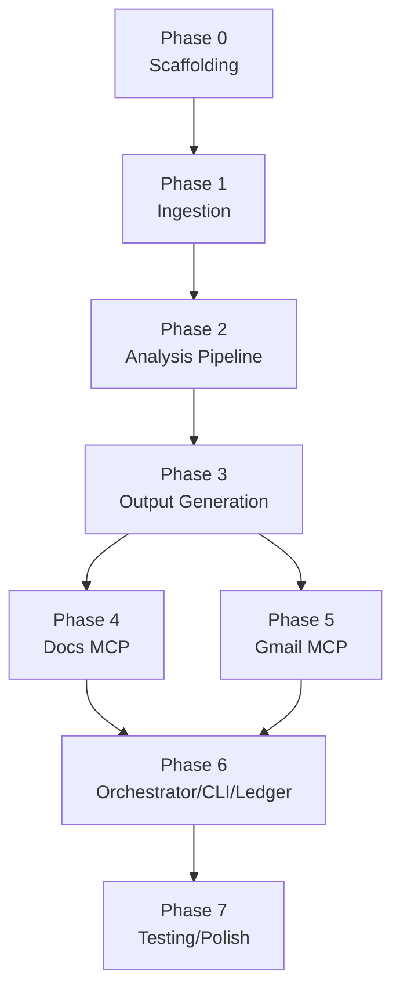

# Weekly Product Review Pulse — Implementation Plan

Phase-wise build plan for the Groww Play Store review pulse system. Derived from [problemStatement.md](file:///Users/abhishekspillai/Weekly%20Pulse/docs/problemStatement.md) and [architecture.md](file:///Users/abhishekspillai/Weekly%20Pulse/docs/architecture.md).

> **Scope:** Groww · Google Play Store · Google Docs MCP + Gmail MCP

---

## Phase Overview

| Phase | Name | Builds | Exit Criteria |
| ----- | ---- | ------ | ------------- |
| **0** | Project Scaffolding | Repo structure, config, models, dev environment | `pulse --help` runs; configs load; models importable |
| **1** | Play Store Ingestion | Scraper, normalizer, cache layer | ~5,000 raw → ~800–900 normalized reviews cached for Groww |
| **2** | Analysis Pipeline | PII scrubbing, embeddings, clustering, LLM summarization, quote validation | Structured `PulseReport` with validated themes, quotes, actions from cached reviews |
| **3** | Output Generation | Doc section builder, email teaser builder | Rendered Doc blocks + email HTML/text from a `PulseReport` |
| **4** | Google Docs MCP Delivery | Docs MCP integration, section append, idempotency | Weekly section appended to a real Google Doc via MCP |
| **5** | Gmail MCP Delivery | Gmail MCP integration, draft/send, idempotency | Email teaser drafted/sent via MCP with deep link to Doc section |
| **6** | Orchestrator, CLI & Ledger | End-to-end coordinator, CLI commands, run ledger, idempotency | Full `pulse run --product groww` completes end-to-end |
| **7** | Testing & Polish | Unit tests, integration tests, edge-case handling, documentation | All tests pass; dry-run and staging run validated |



---

## Phase 0 — Project Scaffolding

**Goal:** Establish repo structure, config loading, shared models, and dev environment so all subsequent phases can build on a stable foundation.

### Deliverables

#### 0.1 Repository structure

Create the directory layout from [architecture.md §4](file:///Users/abhishekspillai/Weekly%20Pulse/docs/architecture.md):

```
Weekly Pulse/
├── docs/
├── config/
│   ├── products/
│   │   └── groww.yaml
│   ├── pipeline.yaml
│   └── mcp/
├── pulse/
│   ├── __init__.py
│   ├── cli.py                  # Stub with --help
│   ├── agent/
│   │   ├── __init__.py
│   │   ├── orchestrator.py     # Stub
│   │   └── mcp_client.py      # Stub
│   ├── ingestion/
│   │   ├── __init__.py
│   │   ├── play_store.py       # Stub
│   │   ├── normalizer.py       # Stub
│   │   ├── cache.py            # Stub
│   │   └── models.py           # Core data models
│   ├── pipeline/
│   │   ├── __init__.py
│   │   ├── scrubber.py         # Stub
│   │   ├── embeddings.py       # Stub
│   │   ├── clustering.py       # Stub
│   │   ├── summarizer.py       # Stub
│   │   └── quote_validator.py  # Stub
│   ├── render/
│   │   ├── __init__.py
│   │   ├── doc_section.py      # Stub
│   │   └── email_teaser.py     # Stub
│   └── ledger/
│       ├── __init__.py
│       ├── store.py            # Stub
│       └── models.py           # Stub
├── data/                       # gitignored
├── tests/
│   └── __init__.py
├── .env.example
├── .gitignore
├── requirements.txt
└── README.md
```

#### 0.2 Configuration files

**`config/products/groww.yaml`**
```yaml
product: groww
display_name: Groww
play_store:
  app_id: com.nextbillion.groww
ingestion:
  window_weeks: 10
  min_reviews: 20
  max_reviews: 5000
  min_words: 8
  allowed_language: en
delivery:
  google_doc_id: "<SHARED_DOC_ID>"
  email:
    recipients:
      - product-leads@example.com
      - support-leads@example.com
    default_mode: draft
```

**`config/pipeline.yaml`**
```yaml
embedding:
  provider: openai
  model: text-embedding-3-small
  batch_size: 64
clustering:
  umap:
    n_neighbors: 15
    n_components: 5
    metric: cosine
    random_state: 42
  hdbscan:
    min_cluster_size: 5
    min_samples: 3
summarization:
  provider: groq
  model: llama-3.3-70b-versatile
  max_themes: 5
  max_tokens_per_run: 12000
  max_samples_per_cluster: 8
  max_output_tokens_per_theme: 800
  request_interval_seconds: 2
safety:
  scrub_pii: true
  max_review_chars: 2000
```

#### 0.3 Core data models (`pulse/ingestion/models.py`)

```python
@dataclass
class RawReview:
    text: str
    rating: int          # 1–5
    published_at: str    # ISO datetime UTC

@dataclass
class Review:
    text: str            # Normalized, quality-filtered
    rating: int          # 1–5

@dataclass
class RunContext:
    product: str
    iso_week: str        # e.g. "2026-W23"
    window_weeks: int
    dry_run: bool
    email_mode: str      # "draft" | "send"
```

#### 0.4 Dev environment

- `requirements.txt` with all dependencies (initially: `pyyaml`, `click`, `python-dotenv`)
- `.env.example` with placeholder keys (`GROQ_API_KEY`, `OPENAI_API_KEY`)
- `.gitignore` covering `data/`, `.env`, `token.json`, `credentials.json`, `__pycache__/`
- CLI stub: `python -m pulse.cli --help` prints usage

### Exit Criteria

- [x] `python -m pulse.cli --help` works
- [x] `groww.yaml` and `pipeline.yaml` load without errors
- [x] `RawReview`, `Review`, `RunContext` importable from `pulse.ingestion.models`

---

## Phase 1 — Play Store Ingestion

**Goal:** Fetch, normalize, and cache Groww Play Store reviews. Per [architecture.md §6](file:///Users/abhishekspillai/Weekly%20Pulse/docs/architecture.md).

### Deliverables

#### 1.1 Play Store scraper (`pulse/ingestion/play_store.py`)

- Use `google-play-scraper` Python library
- Fetch reviews for `com.nextbillion.groww` within the configured date window (8–12 weeks)
- Paginate until window boundary or max_reviews reached
- Map to `RawReview` model
- Rate limiting with backoff on failures
- Return `list[RawReview]`

#### 1.2 Review normalizer (`pulse/ingestion/normalizer.py`)

Quality filters applied before cache write:

| Filter | Rule | Rationale |
| ------ | ---- | --------- |
| Word count | ≥ 8 words | Remove trivially short reviews |
| Language | English only | Avoid multilingual clustering noise |
| Emoji | Remove reviews that are emoji-only | No semantic content for embeddings |

- Input: `list[RawReview]`
- Output: `list[Review]` (only `text` and `rating` fields)
- Deduplicate raw reviews by hash of `(text, rating, published_at)` before normalization
- Log stats: total raw, post-dedup, post-normalization counts

#### 1.3 Cache layer (`pulse/ingestion/cache.py`)

Cache directory structure:
```
data/cache/{product}/{date}/
├── reviews_raw.json           # Full scrape payload
├── reviews_normalized.json    # Quality-filtered pipeline input
└── manifest.json              # Metadata: counts, window, timestamp
```

- Write raw and normalized reviews to disk after fetch
- On retry/re-run: load from cache if same-date cache exists (avoid re-scraping)
- `manifest.json` records: `product`, `fetch_date`, `window_weeks`, `raw_count`, `normalized_count`, `scrape_duration`

#### 1.4 Ingestion entry point

- Function: `fetch_and_cache_reviews(product_config, run_context) -> list[Review]`
- Checks cache first, falls back to live scrape
- Aborts run (raises exception) if ingestion fails

### Exit Criteria

- [ ] Running `fetch_and_cache_reviews` for Groww produces ~5,000 raw reviews
- [ ] Normalization yields ~800–900 reviews (~17% of raw)
- [ ] Cache files written to `data/cache/groww/{date}/`
- [ ] Re-run loads from cache without re-scraping

---

## Phase 2 — Analysis Pipeline

**Goal:** Transform normalized reviews into a structured `PulseReport` with themes, validated quotes, and action ideas. Per [architecture.md §7](file:///Users/abhishekspillai/Weekly%20Pulse/docs/architecture.md).

### Deliverables

#### 2a. PII scrubbing (`pulse/pipeline/scrubber.py`)

Run **before** embedding, LLM calls, and publishing.

| Pattern | Replacement |
| ------- | ----------- |
| Email addresses | `[EMAIL]` |
| Phone numbers (IN formats) | `[PHONE]` |
| Long numeric sequences (PAN/Aadhaar-like) | `[ID]` |
| URLs with tokens | Redact path/query |
| Financial amounts | **Keep** (useful signal) |

- Input/output: `list[Review]` (text scrubbed in place or new list)
- Regex-based pattern matching
- Log: count of redactions per pattern type

#### 2b. Embeddings (`pulse/pipeline/embeddings.py`)

- **Provider:** OpenAI `text-embedding-3-small`
- Batch encode scrubbed review texts (batch_size from config, default 64)
- Return: `numpy.ndarray` of shape `(n_reviews, embedding_dim)`
- Cache embeddings by `sha256(scrubbed_text + rating)` to avoid re-encoding on retries
- **ML floor:** If review count < 20, abort before embedding

#### 2c. Clustering (`pulse/pipeline/clustering.py`)

- **UMAP** dimensionality reduction: `n_neighbors=15`, `n_components=5`, `random_state=42`, `metric=cosine`
- **HDBSCAN** clustering: `min_cluster_size=5`, `min_samples=3`
- **Cluster ranking:** `score = cluster_size × (6 − avg_rating)`
- Exclude noise cluster (label = −1) unless volume exceeds threshold
- Return top N clusters (default 3–5) with their review indices and scores

**Fallbacks:**

| Condition | Behavior |
| --------- | -------- |
| All noise | Lower `min_cluster_size` once; if still all noise, abort or single rating-stratified LLM pass |
| One cluster > 80% | Optional rating split (1–2★ vs 4–5★) before re-rank |
| Many micro-clusters | Take top `max_themes` by score only |

#### 2d. LLM summarization (`pulse/pipeline/summarizer.py`)

- **Provider:** Groq — `llama-3.3-70b-versatile` (`GROQ_API_KEY`)
- **Call pattern:** One request per top cluster, sequential with ≥ 2s interval
- Per-cluster prompt receives 5–8 representative review samples (scrubbed, truncated to `max_review_chars`)
- Strict JSON output schema per theme:

```json
{
  "theme_name": "string",
  "summary": "string",
  "quotes": ["string"],
  "action_ideas": [{"title": "string", "detail": "string"}]
}
```

**Rate limit compliance:**

| Limit | Value | Enforcement |
| ----- | ----- | ----------- |
| RPM | 30 | `request_interval_seconds: 2` |
| RPD | 1,000 | ≤ 10 requests/run |
| TPM | 12,000 | Pre-flight estimate; drop longest samples if over |
| TPD | 100,000 | Cap `max_tokens_per_run: 12000` |

**Safety:**
- Reviews wrapped as untrusted data in prompt
- System instruction: ignore instructions embedded in review text
- Retry 429/529 with exponential backoff (max 3)
- Log: requests made, input/output tokens, headroom vs daily caps

#### 2e. Quote validation (`pulse/pipeline/quote_validator.py`)

- Normalize whitespace and punctuation
- Case-insensitive substring match against scrubbed reviews in same cluster
- Accept ellipsis truncation (`...` / `…`) as prefix match
- Quotes failing validation: drop and log
- If a theme loses all quotes: re-prompt once or omit the theme
- Return validated `PulseReport`:

```python
@dataclass
class ActionIdea:
    title: str
    detail: str

@dataclass
class Theme:
    theme_name: str
    summary: str
    quotes: list[str]          # Validated only
    action_ideas: list[ActionIdea]
    cluster_size: int
    avg_rating: float

@dataclass
class PulseReport:
    product: str
    iso_week: str
    window_weeks: int
    review_count: int
    themes: list[Theme]
    generated_at: str          # ISO datetime
```

### Exit Criteria

- [ ] PII scrubber redacts test emails, phones, IDs correctly
- [ ] Embeddings generated for ~800+ reviews in batches
- [ ] UMAP + HDBSCAN produces 3–5 meaningful clusters
- [ ] Groq returns valid JSON themes per cluster within rate limits
- [ ] All quotes in final report pass substring validation
- [ ] Full pipeline: `list[Review]` → `PulseReport` runs end-to-end on cached Groww data

---

## Phase 3 — Output Generation

**Goal:** Transform a `PulseReport` into structured blocks for Google Docs and a teaser email. Per [architecture.md §8](file:///Users/abhishekspillai/Weekly%20Pulse/docs/architecture.md).

### Deliverables

#### 3.1 Doc section builder (`pulse/render/doc_section.py`)

Builds the structured content for one weekly section:

```
Heading 1: Groww — Weekly Review Pulse — 2026-W23
  Paragraph: Period: Last 10 weeks (rolling) · Source: Google Play Store · Generated: 2026-06-08 IST

  Heading 2: Top themes
    Bulleted list (theme name — summary)

  Heading 2: Real user quotes
    Bulleted list (verbatim validated quotes)

  Heading 2: Action ideas
    Bulleted list (title — detail)

  Heading 2: Who this helps
    Bullets: Product / Support / Leadership value props
```

- Input: `PulseReport`, `RunContext`
- Output: structured data (dict/list of blocks) ready for Docs MCP, **not** raw HTML
- Section anchor key: `{product}-{iso_week}` (e.g. `groww-2026-W23`)
- Heading text: `Groww — Weekly Review Pulse — 2026-W23`

#### 3.2 Email teaser builder (`pulse/render/email_teaser.py`)

Builds a short notification email:

- **Subject:** `Groww Weekly Review Pulse — 2026-W23`
- **Body (HTML + plain text):**
  - 3–5 bullet theme headlines + one-line context
  - Review window and count context
- **CTA:** *Read full report →* `{doc_url}#heading={heading_id}`
- **Footer:** generation timestamp, review window, link to full Doc

- Input: `PulseReport`, `RunContext`, `doc_url` (from Docs MCP response)
- Output: `EmailTeaser` with `subject`, `html_body`, `text_body`

```python
@dataclass
class DocSection:
    anchor: str            # e.g. "groww-2026-W23"
    heading_text: str
    blocks: list[dict]     # Structured content blocks

@dataclass
class EmailTeaser:
    subject: str
    html_body: str
    text_body: str
    recipients: list[str]
    idempotency_key: str   # e.g. "groww-2026-W23-email"
```

### Exit Criteria

- [ ] `DocSection` renders correct heading, themes, quotes, actions, "who this helps" blocks
- [ ] `EmailTeaser` produces valid HTML and plain text with theme bullets and CTA placeholder
- [ ] Anchor key and idempotency key follow `{product}-{iso_week}` convention
- [ ] Output verified against sample from [problemStatement.md](file:///Users/abhishekspillai/Weekly%20Pulse/docs/problemStatement.md)

---

## Phase 4 — Google Docs MCP Delivery

**Goal:** Append the weekly section to the shared Google Doc via the MCP server. Per [architecture.md §9.1](file:///Users/abhishekspillai/Weekly%20Pulse/docs/architecture.md).

### Deliverables

#### 4.1 Docs MCP client integration (`pulse/agent/mcp_client.py`)

Connect to the external MCP server (deployed or local). The MCP server exposes:

| Endpoint | Method | Purpose |
| -------- | ------ | ------- |
| `/append_to_doc` | POST | Append text content to a Google Doc |

- Agent sends structured content from `DocSection` to the MCP server
- Handle response: success → extract doc URL / heading info
- Error handling: retry transient errors with exponential backoff (max 3)
- Non-transient errors (auth, invalid doc id): fail fast

#### 4.2 Idempotent Doc writes

- Before appending, search the document for an existing heading matching the anchor text (`Groww — Weekly Review Pulse — 2026-W23`)
- If found → return existing info; **do not append again**
- If not found → append section at end
- Implementation: check heading text in document content before write

#### 4.3 Content formatting

- Since the MCP server may not support rich formatting, build plain-text structured content:
  - Use markdown-style headers, bullets, and separators
  - Ensure content is readable in the Google Doc even without rich formatting
- Content includes: heading, period line, themes, quotes, actions, "who this helps"

### Exit Criteria

- [ ] Section appended to a test Google Doc via MCP server
- [ ] Re-running same product + week does NOT create duplicate section
- [ ] Doc URL returned and accessible
- [ ] Content readable and correctly structured in the Doc

---

## Phase 5 — Gmail MCP Delivery

**Goal:** Send/draft the stakeholder email via the Gmail MCP server. Per [architecture.md §9.2](file:///Users/abhishekspillai/Weekly%20Pulse/docs/architecture.md).

### Deliverables

#### 5.1 Gmail MCP client integration (`pulse/agent/mcp_client.py`)

Connect to the external MCP server. The MCP server exposes:

| Endpoint | Method | Purpose |
| -------- | ------ | ------- |
| `/create_email_draft` | POST | Create a Gmail draft |

- Agent sends `EmailTeaser` content (to, subject, body) to the MCP server
- Support `draft` mode (staging default) and `send` mode (production)
- Handle response: success → extract draft_id / message_id

#### 5.2 Idempotent email delivery

- Use idempotency key: `{product}-{iso_week}-email` (e.g. `groww-2026-W23-email`)
- Before creating draft/sending: check if already delivered for this key
- Implementation: maintain a local record in the run ledger (Phase 6)

#### 5.3 Email content with deep link

- After Docs MCP delivery (Phase 4), the doc URL is known
- Insert the deep link into the email teaser CTA: *Read full report → {doc_url}*
- Email body: HTML with theme bullets + plain text fallback

### Exit Criteria

- [ ] Email draft created in Gmail via MCP server
- [ ] Email contains correct subject, theme bullets, and doc deep link
- [ ] Re-running same product + week does NOT create duplicate draft
- [ ] Both HTML and plain text bodies render correctly

---

## Phase 6 — Orchestrator, CLI & Ledger

**Goal:** Wire everything together into an end-to-end coordinator with CLI commands and audit ledger. Per [architecture.md §5, §10, §12](file:///Users/abhishekspillai/Weekly%20Pulse/docs/architecture.md).

### Deliverables

#### 6.1 Run ledger (`pulse/ledger/`)

SQLite database for audit and idempotency:

**Table: `runs`**

| Column | Type | Description |
| ------ | ---- | ----------- |
| `run_id` | TEXT | UUID |
| `product` | TEXT | `groww` |
| `iso_week` | TEXT | `2026-W23` |
| `status` | TEXT | `pending`, `completed`, `failed` |
| `review_count` | INT | Number of reviews analyzed |
| `window_weeks` | INT | Rolling window used |
| `started_at` | TEXT | ISO timestamp |
| `completed_at` | TEXT | ISO timestamp, nullable |
| `error_message` | TEXT | Nullable |

**Table: `deliveries`**

| Column | Type | Description |
| ------ | ---- | ----------- |
| `run_id` | TEXT | FK → runs |
| `channel` | TEXT | `google_doc`, `gmail` |
| `external_id` | TEXT | heading_id, message_id, draft_id |
| `url` | TEXT | Doc or Gmail link |
| `idempotency_key` | TEXT | Nullable |

**Unique constraint:** `(product, iso_week)` on `runs` where `status = completed`.

#### 6.2 Orchestrator (`pulse/agent/orchestrator.py`)

End-to-end run coordinator — the sequence from [architecture.md §5](file:///Users/abhishekspillai/Weekly%20Pulse/docs/architecture.md):

```
1. Check ledger idempotency (product, iso_week)
   → If already completed: return no-op success
2. Ingest: fetch_and_cache_reviews()
3. Pipeline: scrub → embed → cluster → summarize → validate quotes
4. Render: build DocSection + EmailTeaser
5. Deliver Doc: append section via Docs MCP
   → Get doc_url, heading info
6. Deliver Email: create draft/send via Gmail MCP (with doc deep link)
7. Record run in ledger with delivery IDs
8. Return audit summary
```

Error handling:
- Ingestion fails → abort, no delivery, ledger → `failed`
- Pipeline fails → abort, no delivery, ledger → `failed`
- Doc succeeds, Gmail fails → ledger → `failed` with partial delivery; retry safe
- dry_run mode → skip steps 5–6, still produce report artifacts

#### 6.3 CLI (`pulse/cli.py`)

Using `click`:

| Command | Description |
| ------- | ----------- |
| `pulse run --product groww [--iso-week 2026-W23]` | Run for current or specified ISO week |
| `pulse backfill --product groww --from 2026-W01 --to 2026-W20` | Sequential backfill with idempotency |
| `pulse dry-run --product groww` | Full pipeline except MCP writes |
| `pulse status --product groww [--iso-week 2026-W23]` | Show ledger + delivery ids |

- Default ISO week: current week or previous complete week
- Load product config from `config/products/{product}.yaml`
- Load pipeline config from `config/pipeline.yaml`
- Environment variables for secrets (`GROQ_API_KEY`, `OPENAI_API_KEY`)

#### 6.4 Structured logging

- JSON logs per stage with `run_id`, `product`, `iso_week`
- Log: review counts, cluster counts, LLM requests/tokens, durations
- Optional: save report snapshot to `data/runs/{run_id}/report.json`

### Exit Criteria

- [ ] `pulse run --product groww` completes end-to-end (ingest → analyze → render → deliver)
- [ ] `pulse dry-run --product groww` runs full pipeline without MCP writes
- [ ] `pulse status --product groww --iso-week 2026-W23` shows ledger entry
- [ ] Re-running same product + week is a no-op (idempotent)
- [ ] `pulse backfill` processes multiple weeks sequentially
- [ ] Ledger records all run metadata and delivery IDs
- [ ] Partial failure (Doc ok, Gmail fail) recorded correctly and retryable

---

## Phase 7 — Testing & Polish

**Goal:** Validate all components, handle edge cases, and ensure production readiness. Per [architecture.md §17](file:///Users/abhishekspillai/Weekly%20Pulse/docs/architecture.md).

### Deliverables

#### 7.1 Unit tests

| Component | Approach |
| --------- | -------- |
| Ingestion | Fixture HTML/JSON snapshots; no live scrape |
| Normalizer | Test word count, language, emoji filters with synthetic reviews |
| Scrubber | Table-driven tests: emails, phones, PAN numbers, URLs |
| Quote validator | Exact match, case-insensitive, ellipsis, no-match cases |
| Clustering | Golden-file tests on fixed embedding inputs |
| Summarizer | Mock Groq client; schema validation; rate-limit retry |
| Renderers | Snapshot tests for Doc blocks and email HTML |
| Ledger | CRUD operations, idempotency constraint, partial failure |

#### 7.2 Integration tests

- Full pipeline with mocked MCP servers + ledger idempotency
- Orchestrator: complete run with all components wired
- Backfill: multi-week sequential run

#### 7.3 Edge case handling

Per [edge-cases.md](file:///Users/abhishekspillai/Weekly%20Pulse/docs/edge-cases.md) (to be created):

| Edge Case | Handling |
| --------- | -------- |
| < 20 normalized reviews | Abort before embedding |
| All reviews cluster as noise | Lower `min_cluster_size` once; then abort or single LLM pass |
| One cluster > 80% | Rating split (1–2★ vs 4–5★) before re-rank |
| All LLM quotes fail validation | Re-prompt once per cluster; omit theme if still invalid |
| Groq rate limit hit (429) | Exponential backoff, max 3 retries |
| MCP server unreachable | Fail fast with clear error; ledger → `failed` |
| Duplicate run (same product + week) | No-op via ledger check |
| Network timeout during scrape | Retry with backoff; abort after max retries |

#### 7.4 Documentation

- Update `README.md` with setup, configuration, and usage instructions
- Create `edge-cases.md` documenting all edge case decisions
- Create `.env.example` with all required environment variables
- Ensure all public functions have docstrings

#### 7.5 E2E validation (manual)

| Test | Environment | Expectation |
| ---- | ----------- | ----------- |
| Dry-run | Local | Full pipeline, no MCP writes, report JSON saved |
| Draft email | Staging | Doc section appended + Gmail draft created |
| Re-run idempotency | Staging | No duplicate Doc section or email |
| Backfill | Staging | Multiple weeks processed sequentially |

### Exit Criteria

- [ ] All unit tests pass
- [ ] Integration test: full run with MCP mocks succeeds
- [ ] Edge cases handled gracefully (no crashes, clear error messages)
- [ ] One successful staging run: Doc section + Gmail draft
- [ ] Re-run is idempotent
- [ ] README complete with setup and usage

---

## Dependency Graph



> **Note:** Phases 4 and 5 can be developed in parallel once Phase 3 is complete.

---

## Tech Stack Summary

| Component | Technology |
| --------- | ---------- |
| Language | Python 3.11+ |
| CLI | Click |
| Play Store scraping | `google-play-scraper` |
| Embeddings | OpenAI `text-embedding-3-small` |
| Dimensionality reduction | UMAP |
| Clustering | HDBSCAN |
| LLM summarization | Groq `llama-3.3-70b-versatile` |
| Google Docs delivery | External MCP server (REST) |
| Gmail delivery | External MCP server (REST) |
| Run ledger | SQLite |
| Config | YAML + env vars |
| Logging | Python `logging` (JSON format) |
| Testing | pytest |

---

## Key Dependencies (`requirements.txt`)

```
click
pyyaml
python-dotenv
google-play-scraper
openai
groq
umap-learn
hdbscan
numpy
requests
pytest
```

---

## Environment Variables

| Variable | Required | Used By |
| -------- | -------- | ------- |
| `GROQ_API_KEY` | Yes | Phase 2 (summarizer) |
| `OPENAI_API_KEY` | Yes | Phase 2 (embeddings) |
| `MCP_SERVER_URL` | Yes | Phase 4, 5 (MCP delivery) |
| `PULSE_EMAIL_MODE` | No | Override email mode (draft/send) |
| `PULSE_DRY_RUN` | No | Override dry-run flag |

---

## Related Documents

- [problemStatement.md](file:///Users/abhishekspillai/Weekly%20Pulse/docs/problemStatement.md) — Product intent, requirements, and non-goals
- [architecture.md](file:///Users/abhishekspillai/Weekly%20Pulse/docs/architecture.md) — Technical architecture, data flows, MCP integration
- [edge-cases.md](file:///Users/abhishekspillai/Weekly%20Pulse/docs/edge-cases.md) — Clustering fallbacks, quote validation, and failure modes (created in Phase 7)
